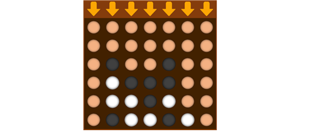

# About
A connect-four game implemented with JAVA awt and swing. The AI is implemented using simple MCTS algorithm

JAVA awt와 swing을 이용해 구현한 4목 게임입니다. 게임 AI는 몬테카를로 트리 탐색 알고리즘을 이용해 구현했습니다.



## AI algorithm
The basic algorithm is simplified MCTS. The pureMCTS agent makes a decision by simulating 100 random actions repeatedly until the end of the game, and taking the move that made the best average outputs (1 for a win, 0 for a lose). There is also a FastFinishMCTS agent implemented, where the agent gets a larger reward for faster win. This agent finishes the game 2~3 moves earlier than the pureMCTS agent does, on average.

AI는 단순화된 MCTS(몬테카를로 트리 탐색) 알고리즘을 이용해 구현했습니다. PureMCTS agent는 가능한 수마다 100개의 게임을 무작위하게 시뮬레이션하고, 그중 가장 승률이 높은 수를 선택합니다 (각 시뮬레이션에서 이기면 1점, 지면 0점을 더합니다). FastFinishMCTS agent에서는 시뮬레이션을 빨리 끝낼 때 추가적인 점수를 주며, 이에 따라 PureMCTS agent보다 평균적으로 2~3차례 일찍 게임을 끝마칩니다.

## How to use
```java
public static void main(String[] args) {
    new ConnectFour(100,"NoGraphics","PureMCTS","FastFinishMCTS");
}
```
You can run the program using the ConnectFour constructor in the main function. The role of the arguments are as follows.
> i: The number of games (or simulations) you want to play. You may omit this argument.

> Graphic: Determines the GUI you want to use. "NoGraphics" will not show anything. "Console" will display the game on console. "Graphics" will display the game using awt and swing.

> P1/P2: Determines the player that plays the game. "Console" will let you make moves using the console. "Graphics" will let you make moves by clicking buttons on the awt/swing GUI. You can also choose an AI as the player. "Random" will make the AI play the game randomly. "PureMCTS" will make the AI play the game using the PureMCTS algorithm. "FastFinishMCTS" will make the AI play the game using the FastFinishMCTS algorithm.

Main 함수 안에 있는 ConnectFour 생성자를 이용하여 게임을 실행할 수 있습니다. 전달되는 매개변수는 다음과 같습니다.
> i: 게임(또는 시뮬레이션)을 실행할 횟수를 지정합니다. 원한다면 생략할 수 있는 매개변수입니다.

> Graphic: 게임 그래픽을 선택할 수 있습니다. "NoGraphics"를 선택하면 그래픽이 보이지 않습니다. "Console"을 선택하면 콘솔 창에 게임 화면이 나타납니다. "Graphics"를 선택하면 awt/swing을 이용해 구현된 GUI가 보여집니다.

> P1/P2: 입력 방식, 또는 AI 종류를 선택합니다. "Console"을 선택하면 콘솔 창에서 입력할 수 있습니다. "Graphics"를 선택하면 awt/swing GUI에 있는 버튼을 클릭해 입력할 수 있습니다. "Random"을 선택하면 무작위로 행동을 취하는 Random agent가 게임을 플레이합니다. "PureMCTS"를 선택하면 PureMCTS 알고리즘을 이용하는 AI가 게임을 플레이합니다. "FastFinishMCTS"를 선택하면 FastFinishMCTS 알고리즘을 이용하는 Ai가 게임을 플레이합니다.
